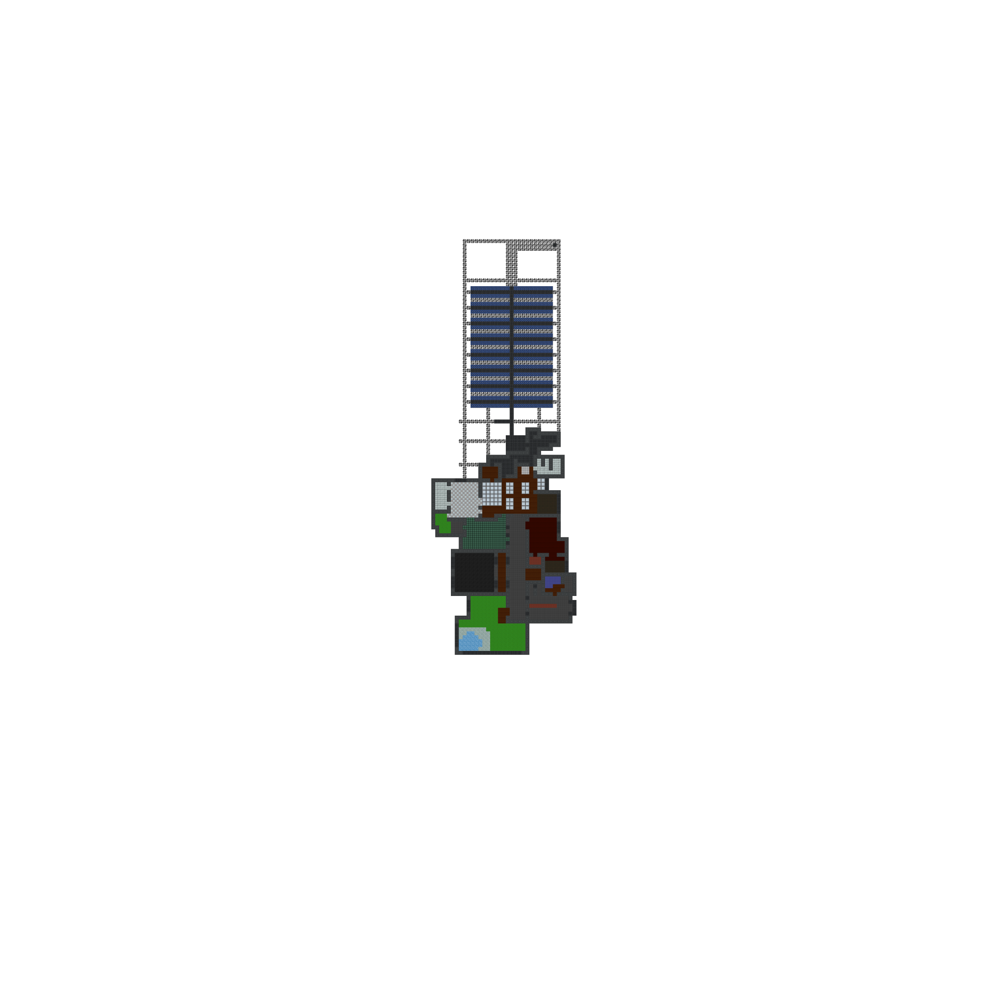
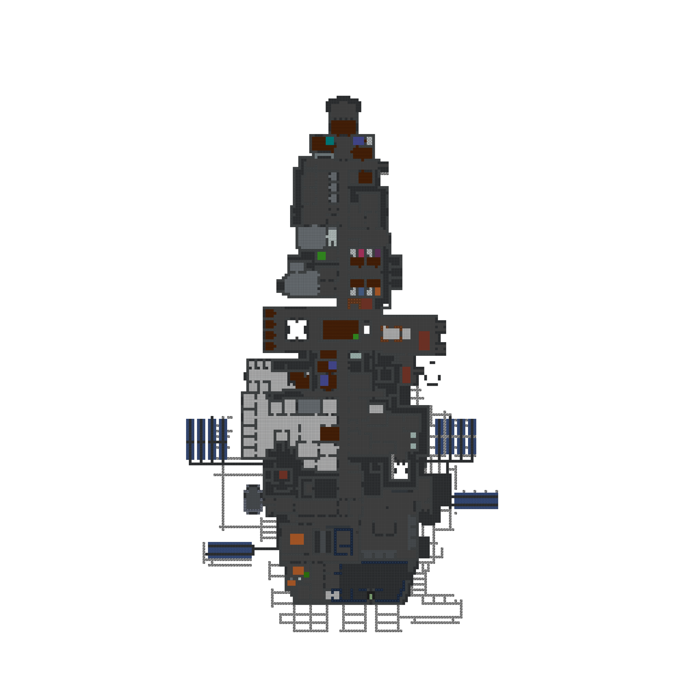
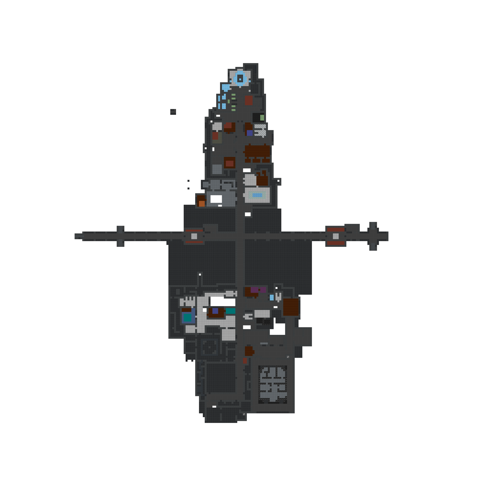
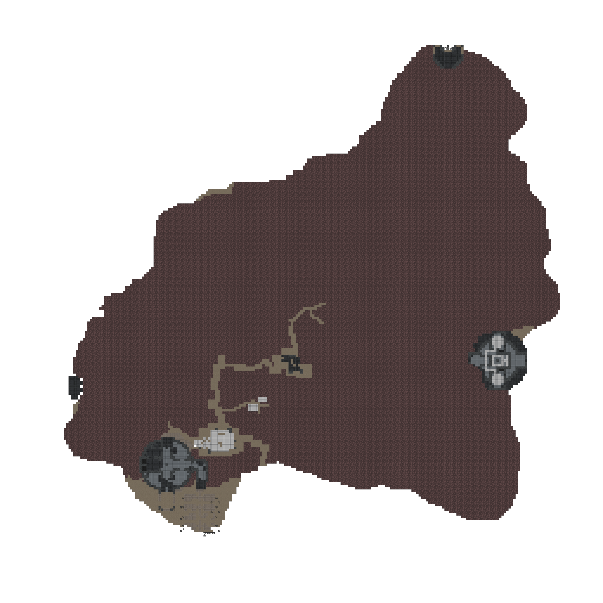
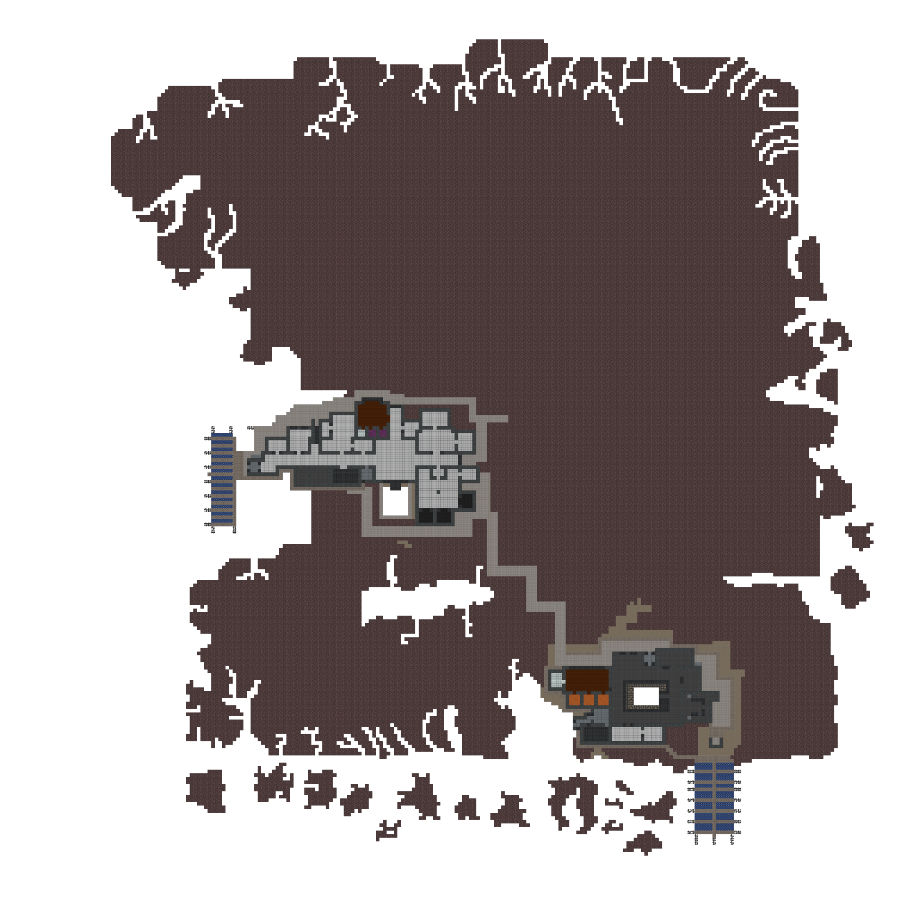
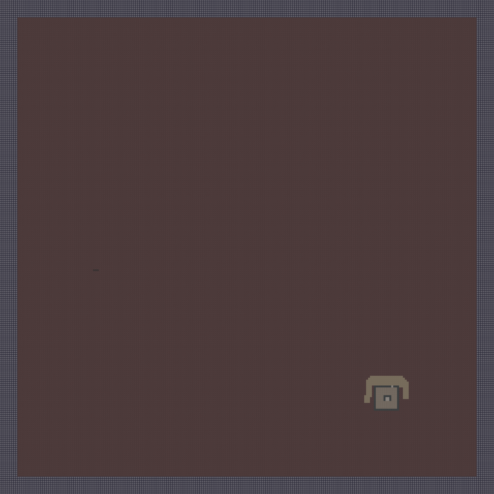
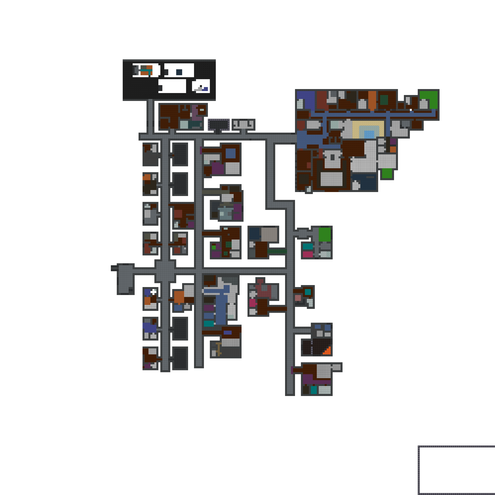
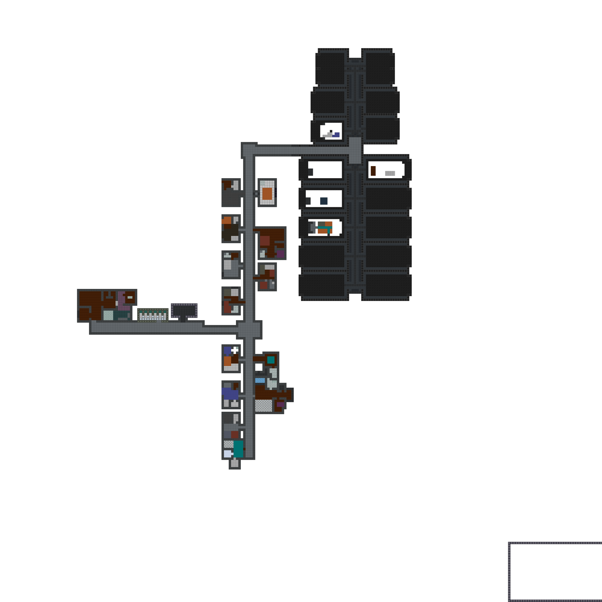

# Map Preview

## Table of Contents:
1. [Level One - GUTS](#level-one---guts)
1. [Level Two - Deck 2](#level-two---deck-2)
1. [Level Three - Deck 3](#level-three---deck-3)
1. [Asteroid](#asteroid)
1. [Mining](#mining)
1. [Underdark](#underdark)
1. [Biodome](#biodome)
1. [Upper Residential](#upper-residential)
1. [Mansion](#mansion)
1. [Lower Residential](#lower-residential)

---

## Level One - GUTS
 

---

## Level Two - Deck 2
 

---

## Level Three - Deck 3
 

---

## Asteroid
 

---

## Mining
 

---

## Underdark
 

---

## Biodome
 

---

## Upper Residential
 

---
## Mansion
 

---

## Lower Residential
 

